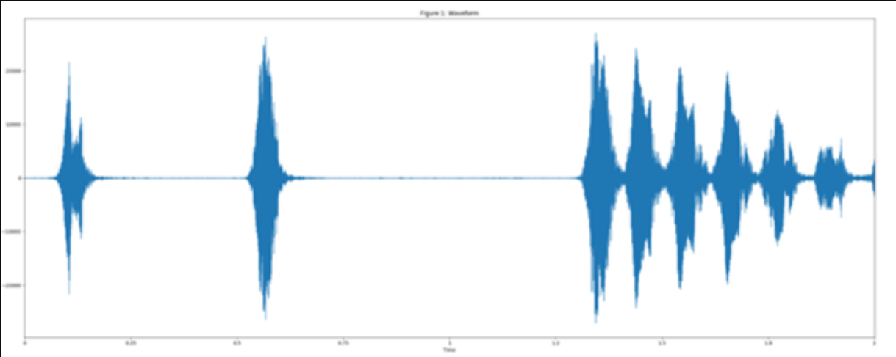
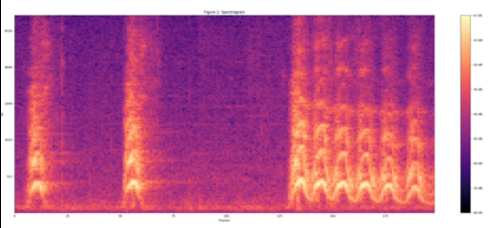
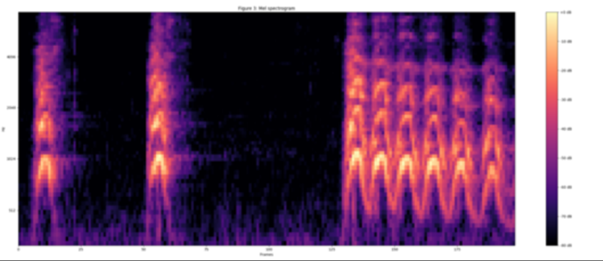
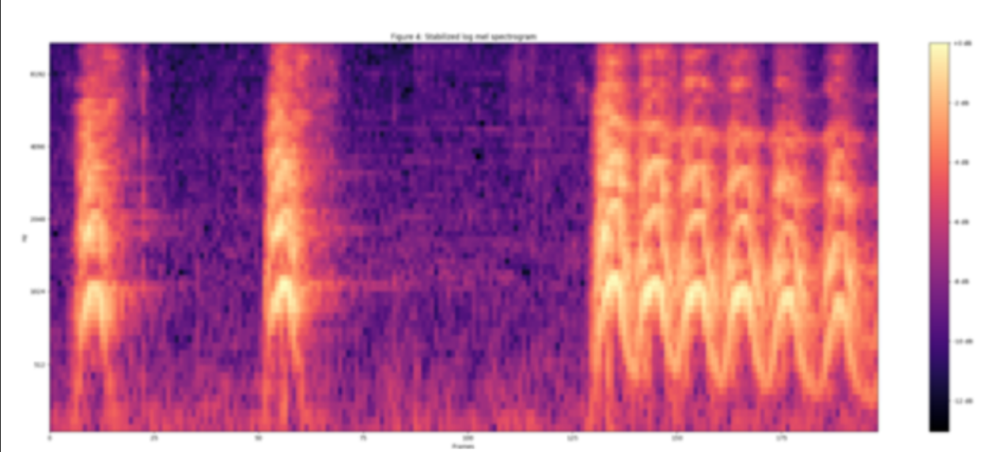

VGGish的优势在于，这是Google在一个名为Audioset的庞大数据集上进行长时间训练出来的。

VGGish支持从音频波形中提取具有语义的128维embedding特征向量。

VGGish模型将音频输入特征转化为具有语义和有意义的128 维high-level的特征向量，而128维high-level特征向量可以作为下游模型的输入。

# VGGish提取特征过程

**输入数据为wav音频文件，音频文件的特征提取过程如下：**

1. 将音频重采样为16kHz单声道音频；
2. 使用25 ms的Hann时窗，10 ms的帧移对音频进行短时傅里叶变换得到频谱图；
3. 通过将频谱图映射到64阶mel滤波器组中计算mel声谱；
4. 计算 log(mel-spectrum + 0.01)，得到稳定的 mel 声谱，所加的 0.01 的偏置是为了避免对 0 取对数；
5. 然后这些特征被以 0.96s的时长被组帧，并且没有帧的重叠，每一帧都包含 64 个mel 频带，时长 10ms（即总共 96 帧）。

VGGish模型输出数据格式为[nums_frames， 128]，其中nums_frames为帧长，nums_frames=音频时长/0.96。

# VGGish模型文件

**VGGish模型包含8个python脚本文件：**

- vggish_slim.py: TensorFlow Slim中模型定义。
- vggish_params.py：超参数。
- vggish_input.py：音频波形转换为所需的输入数据格式。
- mel_features.py：音频特征提取。
- vggish_postprocess.py：后处理embedding。
- vggish_inference_demo.py：显示了如何从任意音频中生成VGGish embedding。
- vggish_train_demo.py：显示了如何在VGGish之上添加模型并训练整个模型
- vggish_smoke_test.py：VGGish安装成功测试

# 数据处理示例

1. 将音频重采样为 16kHz 单声道（vggish_input.py）,如图1所示，此时输出数据格式为[num_samples, 96, 64]， 其中num_samples与音频的时长有关。

2. 使用 25ms 的帧长、10ms 的帧移，以及周期性的 Hann 窗口对语音进行分帧，对每一帧做短时傅里叶变换，然后利用信号幅值计算声谱图，如图2所示。

3. 通过将声谱映射到 64 阶 mel 滤波器组中计算 mel 声谱， 如图3所示。

4. 计算 log(mel-spectrum + 0.01)，得到稳定的 mel 声谱（图4），所加的 0.01 的偏置是为了避免对 0 取对数

然后这些特征被以 0.96s的时长被组帧，并且没有帧的重叠，每一帧都包含 64 个 mel 频带，时长 10ms（即总共 96 帧）。这些组帧后的特征数据格式为[nums_frames, 128]特征向量，将输入给下游模型进行进一步训练。

